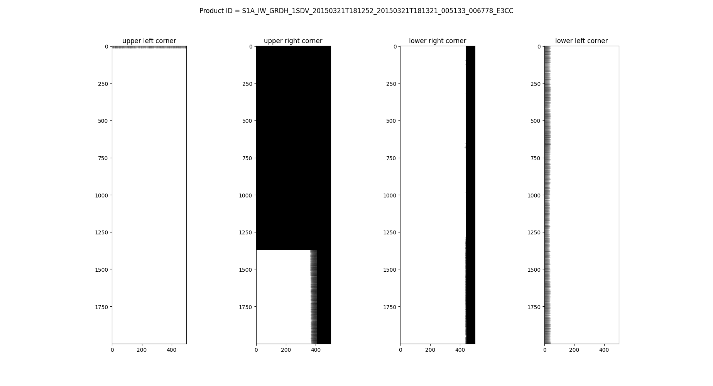
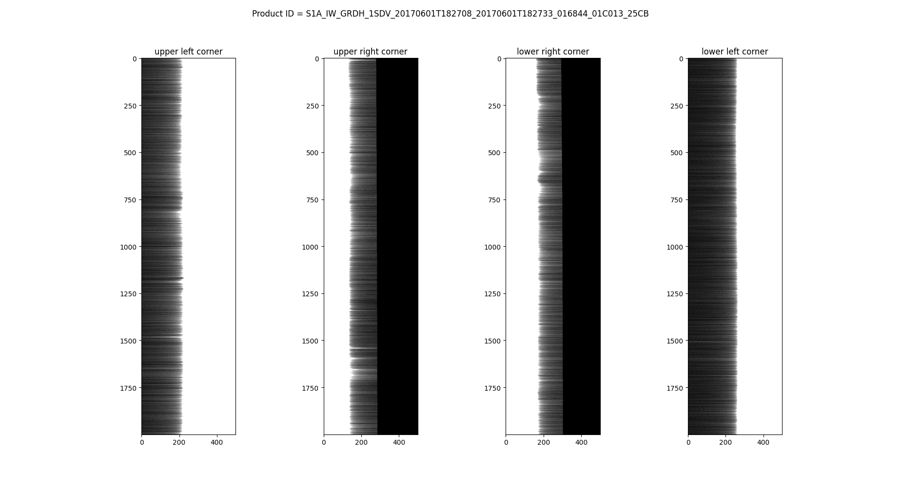
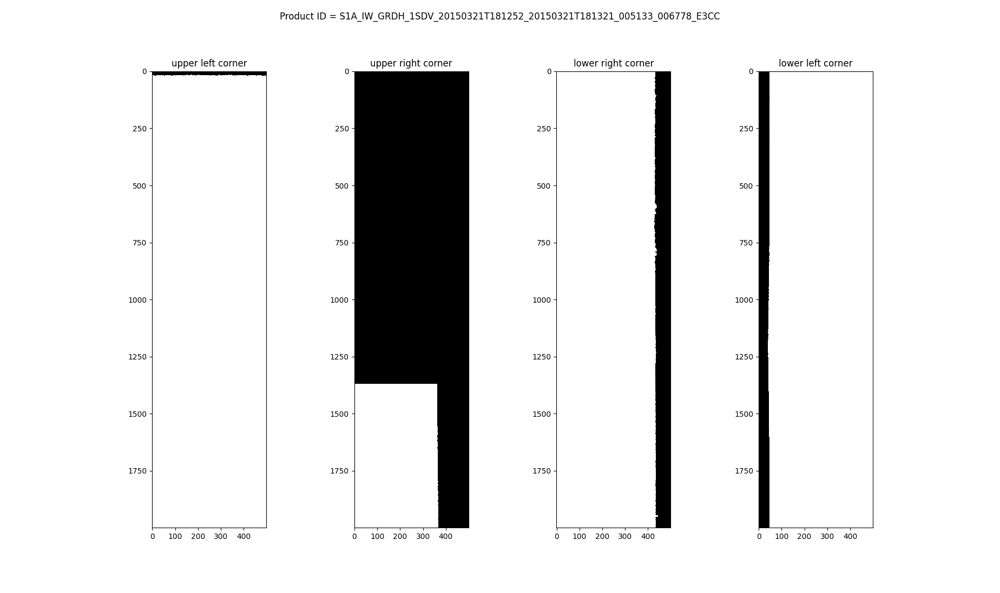
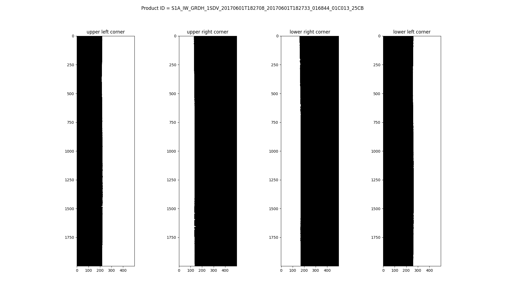
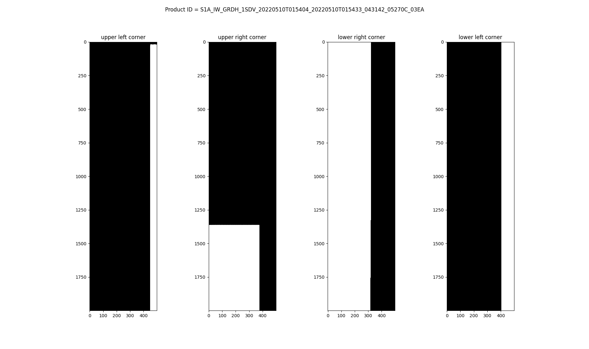

# Border noise masking algorithm in eos-sar package for Sentinel-1 GRD products

|        | |
|--------------| --- |
| Prepared by: | Antoine Ba, Remote Sensing Engineer - Kayrros |

# Acronyms and abbreviations
|  |                                |
|--------|--------------------------------|
| DN     | Digital Number                 |
| GRD    | Ground Range Detected          |
| IPF    | Instrument Processing Facility |
| SLC    | Single Look Complex            |
| SNAP   | Sentinel Application Platform  | 

# Applicable and reference documents
## Applicable document
## Reference documents
|  |                                                                                |
|--------|--------------------------------------------------------------------------------|
| [1]    | Masking "No-value" Pixels on GRD Products generated by the Sentinel-1 ESA IPF  |

## Introduction
The eos-sar python package allows to process Sentinel-1 SLC and GRD products (precise orbit file application, calibration, denoising, Radiometric Terrain Correction, localization and projection) internally at Kayrros, without using SNAP. 
This recently developed package is still under improvement and one of those improvements is the masking of the borders for S-1 GRD products. 
Indeed, when calibrating/denoising the raster of a given product (in sensor geometry) and clipping pixels that are considered noise to zero, there are no indications of whether the pixels are inside the valid data of the raster or if they are part of the border. 
Additionally, in order to be able to clip the noise, a scaling factor has been taken into account in eos-sar while calibrating/denoising, following the recommendations in [1] and according to the Instrument Processing Facility (IPF) version. 
A description of the origin of the border noise is given in [1].
SLC products do not require this masking as the valid areas are already provided as metadata.

This document describes a tool for computing and applying a border mask on S-1 GRD calibrated and denoised rasters only. 
The method also works for rasters for which the border is already set to zero in Digital Number (DN) (before denoising and calibration) in IPF version > 2.90.

## S-1 GRD products as examples
In order to describe the denoising and the border masking method, we selected three products on which we will apply the processes. 
We voluntarily chose products processed with different versions of the IPF to cover different case studies. The following products were selected:
* S1A_IW_GRDH_1SDV_20150321T181252_20150321T181321_005133_006778_E3CC:
  * IPF v 2.43 
  * Contains mostly water (sea)
* S1A_IW_GRDH_1SDV_20170601T182708_20170601T182733_016844_01C013_25CB:
  * IPF v 2.82
  * Contains mostly land
* S1A_IW_GRDH_1SDV_20220510T015404_20220510T015433_043142_05270C_03EA:
  * IPF v 3.51
  * Contains mostly land

## S-1 GRD denoising

### S-1 GRD noise
As mentioned previously, the border mask computation needs as an input a calibrated and denoised raster. 
Indeed, the denoising is a crucial step in order to clip the raster noise to zero. 
Since denoising cannot be done without calibration in eos-sar (as of version 0.11), we apply both processes to the products tested.

In the figure below, we plot the raster corners for the product S1A_IW_GRDH_1SDV_20150321T181252_20150321T181321_005133_006778_E3CC. 

 
*Raster corners for product S1A_IW_GRDH_1SDV_20150321T181252_20150321T181321_005133_006778_E3CC in DN thresholded at 10.* 

We can see in this product that the edges in the raster corners show some kind of horizontal and vertical stripes. 
These are the noise artifacts generated by the azimuth and range compression and the compensation for the earth curvature in start time sampling [1].

Same as for the 2015 product, we plot in the figure below the corners of product S1A_IW_GRDH_1SDV_20170601T182708_20170601T182733_016844_01C013_25CB.

 
*Raster corners for product S1A_IW_GRDH_1SDV_20170601T182708_20170601T182733_016844_01C013_25CB in DN thresholded at 10.* 

The same type of artifacts appear on this figure. In addition, we can clearly see that the border of the product contains noise AND zero values.

Finally, we plot the corners for product S1A_IW_GRDH_1SDV_20220510T015404_20220510T015433_043142_05270C_03EA. 

 
*Raster corners for product S1A_IW_GRDH_1SDV_20220510T015404_20220510T015433_043142_05270C_03EA in DN thresholded at 10.* 

In the figure above, we see that the artifacts do not appear, meaning that the border noise has been removed during the product processing in the IPF (higher versions).

With the plots above, we can see that following the processing date of a given product, the outcome in terms of border noise varies.
Here are the recommended approaches given in [1]:
* For data processed with IPF 2.90 (and newer version): no specific denoising is required (border already set to zero), meaning that the products border can be masked without denoising (because set to zero);
* For data processed with IPF version higher than 2.50 and up to IPF 2.84, an approach that relies on the usage of the denoising vectors should be used; 
Those denoising vector are considered valid only starting from the IPF version higher than 2.50;
* For data processed with the earlier version, a scaling factor has to be taken into account in denoising;

### S-1 GRD denoising
In eos-sar, the denoising of a S-1 GRD raster is done at the same time as its calibration (conversion to sigma0, beta0 or gamma0 backscatter coefficient). 
See https://sentinels.copernicus.eu/de/web/sentinel/radiometric-calibration-of-level-1-products for details on calibration and [1] for details on the denoising. 
In the following plots, we show the same four corners for each product, after calibration and denoising.

 
*Raster corners for product S1A_IW_GRDH_1SDV_20150321T181252_20150321T181321_005133_006778_E3CC in beta coefficient thresholded at 1e-4.* 

 
*Raster corners for product S1A_IW_GRDH_1SDV_20170601T182708_20170601T182733_016844_01C013_25CB in beta coefficient thresholded at 1e-4.*

 
*Raster corners for product S1A_IW_GRDH_1SDV_20220510T015404_20220510T015433_043142_05270C_03EA in beta coefficient thresholded at 1e-4.* 

In the figures, we can see that the calibration and denoising operations allow to remove the noise by clipping it to zero.
By doing that, the rasters borders are now set to zero. However, there are some values inside the valid part of the raster that are also set to zero but that correspond to valid data (e.g. flat water areas).
Therefore, border noise masking method should allow to generate a mask of the border, without masking the valid pixels set to zero.

## Border masking method
The border masking method is implemented in [eos.sar.products.sentinel1.border_noise_grd](eos/products/sentinel1/border_noise_grd.py). This method uses a calibrated and denoised raster from a GRD product.
This method allows to compute a complete border mask, without regard for the position of the borders (left, right, top or bottom). 
The border masking method follows these steps:
* Generate from the calibrated and denoised raster a first approximative mask of booleans (True or False), potentitally containing zeros in the valid part of the raster.
* Get flags of border location from the approximative mask: 
These flags indicate that the approximative mask contains a top, bottom, left or right border, or any combination of these borders.
A flag is given if more than half of the pixels on the first row, last row, first column or last column are False.
This gives an indication of where the border mask should be computed.
* Compute the left or right border mask if the approximative mask contains a left or a right border or both.
  * For each line that is not filled with False (more than half of the values is False), find the first column index that is True (from left to right). This index gives the frontier between the border and the valid data.
  * Since the search for the index of the first column of valid data in the mask is done from left to right, one needs to flip the approximative mask in case of a right border flag (flip from right to left).
* Compute the mask for a top or bottom border if the approximative mask contains a top or a bottom border or both.  
  * For each colum that is not filled with False (boolean), find the first row index that is True (from top to bottom). This index gives the frontier between the border and the valid data.
  * Since the search for the index of the first row of valid data in the mask is done from top to bottom, one needs to flip the approximative mask in case of a bottom border flag (flip from bottom to top).
* Once the masks are computed for the borders, they are concatened to produce a final border mask for the raster.

The user of this method should expect to generate a border mask that is identical to the approximative mask, with the main exception that the zero values inside the valid part of the image remain zero.

## Testing
This method is tested in [tests/test_mask_border_noise_grd.py](tests/test_mask_border_noise_grd.py) for the products S1A_IW_GRDH_1SDV_20170601T182708_20170601T182733_016844_01C013_25CB and S1A_IW_GRDH_1SDV_20220510T015404_20220510T015433_043142_05270C_03EA.
This test consist in comparing the masks generated from the ouputs of the Thermal Noise Removal and Border Noise Removal method implemented in SNAP with the masks generated with the border noise masking in eos-sar.
The test compare masks generated for the top left corner, to right corner, center, bottom left corner and bottom right corner. The test passes if a tolerance requirement of 1% pixel difference between the masks is respected.

## Limitations
Often, the border mask frontier between no data and valid data is similar to a straight line with low variations (small peaks and valleys of a few pixels). 
But in the case of a strong backscatter in valid part of the data close to this frontier, the denoising might not be sufficiently efficient and much more pixels would not be masked (up to 10-20 pixels).
A smarter implementation of the border masking (with moving window) could be implemented in later versions of border_noise_grd.py.
